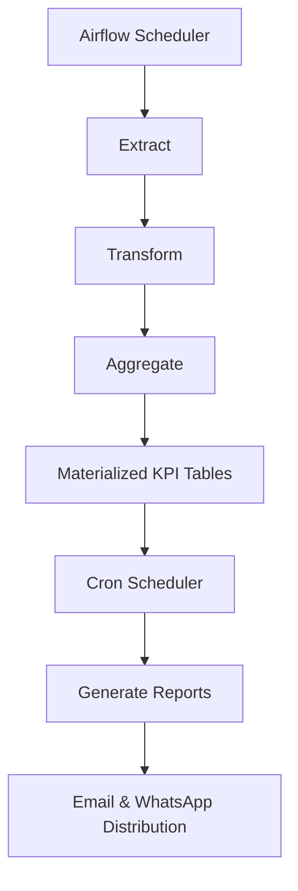

# Sales Analysis Automation System
# Flowchart


## Overview
### This project is a fully automated sales reporting engine designed to:
- Generate Daily, Weekly, and Monthly business performance reports
- Process structured ETL workflows
- Automatically distribute reports via Email and WhatsApp
- Operate without manual intervention after deployment
### The system follows a hybrid orchestration architecture:
- Apache Airflow → ETL layer
- Cron → Reporting & Notification layer
#### This project intentionally does not include an interactive dashboard or UI.
#### All insights are delivered automatically via scheduled reports.

## Key Capabilities 
- Automated ETL pipeline
- Hybrid orchestration architecture
- Deterministic DAG execution
- Growth comparison logic
- Automated PDF generation
- WhatsApp automation
- Email automation
- Structured logging
- Zero manual operational dependency

## System Architecture
#### The system follows a layered orchestration strategy:

| Layer          | Technology                  | Responsibility                                     |
| -------------- | --------------------------- | -------------------------------------------------- |
| Data Layer     | Apache Airflow (Dockerized) | Extraction, transformation, aggregation            |
| Delivery Layer | Cron (Azure VM)             | Report rendering, browser automation, distribution |

#### This separation enforces:
- Deterministic data workflows
- Runtime isolation
- Fault containment
- Operational stability

### Data Engineering Layer (Apache Airflow)
#### The ETL layer is orchestrated using Apache Airflow, deployed via Docker.
### Responsibility
- Sales data is fetched via API calls from the mainframe database
- Data is loaded into a sandbox / analytics database
- Orchestrates data extraction and transformation tasks
- Manages dependencies between ETL jobs
- Provides retry, monitoring, logging, and scheduling
- Ensures deterministic execution of structured data workflows

## Design Characteristics
- DAG-driven deterministic execution
- Time-window controlled processing
- Safe re-runs (idempotent writes)
- Dependency-aware scheduling
- Controlled retry policy
- Containerized execution environment

### Reporting & Distribution Layer (Cron-Based)
####  The reporting layer runs directly on the Azure VM using cron scheduling.

### Responsibilities
- PDF report generation
- Excel report creation
- WhatsApp automation
- Email distribution
- Duplicate prevention logic
- File-system bound execution

### Why Reporting Is Not in Airflow
#### These workloads depend on:
- Playwright + Chromium browser automation (No Whatsapp API used)
- Xvfb virtual display
- wkhtmltopdf system bindings
- Stateful execution logic
- OS-level binary dependencies

#### Running browser automation inside containerized Airflow workers introduced:
- Browser instability
- Resource contention
- Increased orchestration complexity

#### Therefore, delivery workloads are intentionally isolated at the OS level.
These workloads involve browser sessions and GUI-level automation, which are better handled in controlled shell execution environments rather than containerized orchestration.

## Execution Flow



## Reporting Logic
#### Daily Report
- Store-wise sales
- Category-wise sales
- Brand-wise sales
- Product-wise sales
- Comparison against rolling 7-day average
- Growth percentage computation
- Conditional formatting for performance signals
#### Weekly Report
- Aggregates prior week performance
- Designed for operational and management stakeholders

## Monthly Report
- Consolidated monthly business performance
- Strategic performance summary


## Installation & Setup
##### Clone the Repository:

```bash
git clone https://github.com/SominZex/sales_analysis_algorithm.git
```

```bash
cd sales_analysis_algorithm
```

## Create environment
```bash
python3 -m venv env_name
```

## Activate env
```bash
env_name/bin/activate
```

## Install Dependencies:
```bash
pip install -r requirements.txt
```

### Infrastructure & Deployment
#### Containerized ETL (Docker + Airflow)
Airflow runs in Docker for:
- Environment reproducibility
- Dependency isolation
- Controlled orchestration
- Clean separation from OS-level automation

## Airflow Setup:
### Directory Structure
```bash
/sales_analysis_algorithm/
    /airflow/
        ├── dags/
        ├── docker-compose.yml
```

#### Start
```bash
cd airflow
docker compose up airflow-init
docker compose up -d
```
### Access UI
```bash
http://localhost:8080
```


## Cron Configuration
### Navigate to terminal and type "crontab -e" (linux only) then paste the folllwing cron jobs (make sure you have the necessary shell script created in the directory, .sh files are not included here):
``` bash
45 1 * * * /home/azureuser/sales_analysis_algorithm/run_analysis.sh
50 1 * * * /home/azureuser/sales_analysis_algorithm/wa_sender.sh
05 2 * * 1 /home/azureuser/sales_analysis_algorithm/run_weekly_reports.sh
15 3 * * 1 /home/azureuser/sales_analysis_algorithm/weekly_mail.sh
10 4 1 * * /home/azureuser/sales_analysis_algorithm/monthly_reports.sh
02 5 1 * * /home/azureuser/sales_analysis_algorithm/monthly_mail.sh
```

## Observability & Reliability
#### Logging
#### Logs are generated for:
- ETL execution (Airflow logs)
- Report generation
- Email delivery
- WhatsApp automation

#### Logs support:
- Failure diagnosis
- Operational auditing
- Execution traceability

#### Determinism
- Idempotent data writes
- Controlled execution windows
- Duplicate prevention safeguards
- Explicit scheduling boundaries

#### Fault Containment
- ETL failures isolated from reporting layer
- Reporting failures do not corrupt data layer
- Layered orchestration prevents cascading impact


## CI/Automation
### GitHub Actions are configured for:
- Code validation
- Basic test execution
- Runtime automation is handled exclusively by cron on Azure VM

### Runtime scheduling is controlled by:
- Airflow (Data Layer)
- Cron (Delivery Layer)

## Design Principles
- Separation of concerns
- Deterministic data workflows
- Hybrid orchestration where appropriate
- Infrastructure-aware engineering decisions
- Production stability over tool overuse
- Minimal human operational dependency

## Final Note
#### This system is not a dashboard.
#### It is a production-grade, hybrid-orchestrated Sales Intelligence Automation Engine engineered for: 
- Reliability
- Determinism
- Operational scalability
- Controlled execution boundaries
- Continuous automated insight delivery

