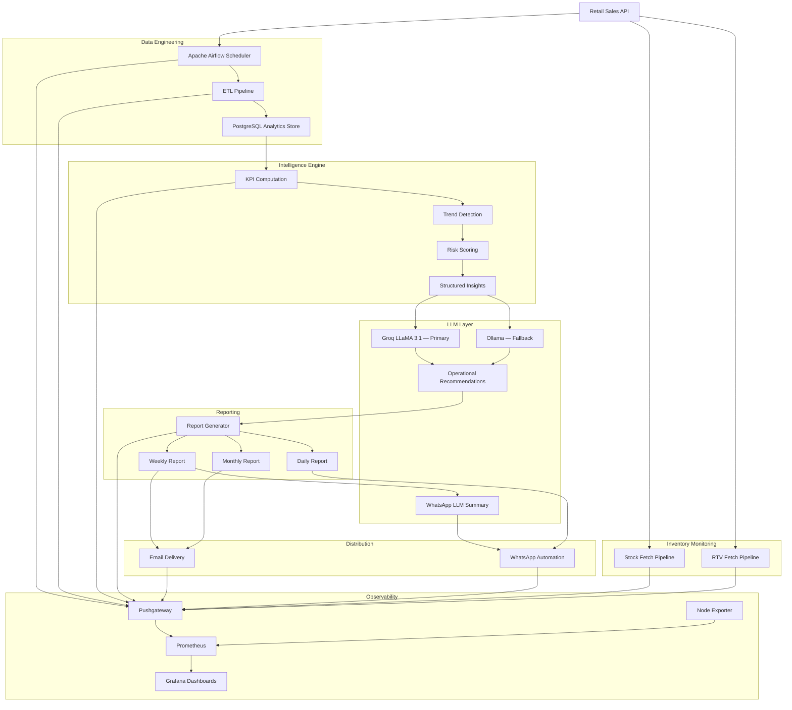
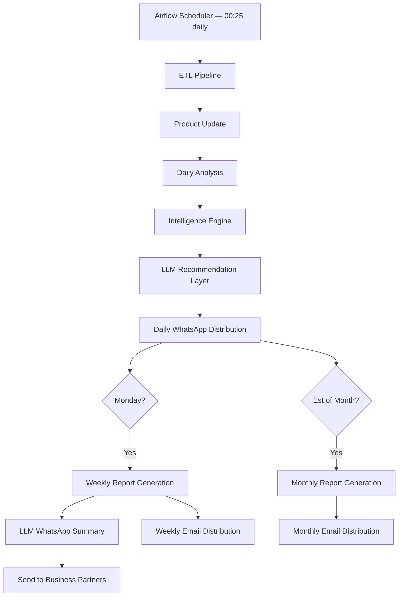

# Sales Intelligence Automation Engine

> A production-grade, fully automated analytics platform that ingests retail sales data, computes deterministic business intelligence signals, and delivers LLM-grounded operational recommendations via scheduled reports and real-time alerts — with zero manual intervention after deployment.

---

## Table of Contents

- [Overview](#overview)
- [System Architecture](#system-architecture)
- [Execution Flow](#execution-flow)
- [Core Capabilities](#core-capabilities)
- [Intelligence Engine](#intelligence-engine)
- [LLM Layer](#llm-layer)
- [Reporting](#reporting)
- [Distribution](#distribution)
- [Inventory & RTV Monitoring](#inventory--rtv-monitoring)
- [Observability](#observability)
- [PySpark & Distributed Computing](#pyspark--distributed-computing)
- [Data Quality & Schema Validation](#data-quality--schema-validation)
- [Reliability & Fault Containment](#reliability--fault-containment)
- [Airflow Orchestration](#airflow-orchestration)
- [Installation & Setup](#installation--setup)
- [Design Principles](#design-principles)

---

## Overview

This system is not a dashboard. It is an automated sales intelligence engine built for multi-store retail operations. Every day, it ingests transactional data, computes KPIs and risk signals, generates store-level LLM recommendations, produces PDF reports, and distributes them — entirely without human intervention.

**What it does:**

- Ingests daily sales data via API into a PostgreSQL analytics store
- Validates schema and data quality before any record enters the database
- Computes revenue, margin, growth, and risk signals deterministically
- Generates LLM-grounded action recommendations constrained to pre-computed facts
- Produces Daily, Weekly, and Monthly PDF reports per store
- Distributes reports via Email and WhatsApp
- Detects low stock, negative stock (GRN anomalies), and RTV patterns
- Sends targeted WhatsApp stock alerts to business partners
- Exposes full pipeline observability via Prometheus and Grafana

---

## System Architecture


```mermaid
flowchart TD

A[Retail Sales API]

subgraph Data Engineering
B[Apache Airflow Scheduler]
C[ETL Pipeline]
D[PostgreSQL Analytics Store]
end

subgraph Intelligence Engine
E[KPI Computation]
F[Trend Detection]
G[Risk Scoring]
H[Structured Insights]
end

subgraph LLM Layer
I[Groq LLaMA 3.1 — Primary]
J[Ollama — Fallback]
K[Operational Recommendations]
W[WhatsApp LLM Summary]
end

subgraph Reporting
L[Report Generator]
M[Daily Report]
N[Weekly Report]
O[Monthly Report]
end

subgraph Distribution
P[Email Delivery]
Q[WhatsApp Automation]
end

subgraph Inventory Monitoring
X[Stock Fetch Pipeline]
Y[RTV Fetch Pipeline]
end

subgraph Observability
R[Prometheus]
S[Pushgateway]
T[Node Exporter]
U[Grafana Dashboards]
end

A --> B
B --> C
C --> D

D --> E
E --> F
F --> G
G --> H

H --> I
H --> J
I --> K
J --> K
K --> L

L --> M
L --> N
L --> O

N --> W
W --> Q
M --> Q
N --> P
O --> P

A --> X
A --> Y

B --> S
C --> S
E --> S
L --> S
P --> S
Q --> S
X --> S
Y --> S

S --> R
T --> R
R --> U
```

### Layer Summary

| Layer | Technology | Responsibility |
|---|---|---|
| Orchestration | Apache Airflow (Docker) | DAG scheduling, retries, dependency management, task isolation |
| Data | PostgreSQL | Analytics storage, snapshot persistence |
| ETL & Transform | PySpark (local / cluster) | Data ingestion, transformation, validation, bulk writes |
| Intelligence | Python — PySpark + Pandas | KPI computation, trend detection, risk scoring |
| LLM | Groq + Ollama | Structured recommendation generation |
| Reporting | PySpark + Python — pdfkit | PySpark aggregations, PDF report generation per store |
| Distribution | SMTP + WhatsApp Business API | Email and WhatsApp delivery |
| Inventory | REST API | Stock and RTV data ingestion |
| Observability | Prometheus + Grafana | Metrics, dashboards, alerting |

---

## Execution Flow


```mermaid
flowchart TD
    A[Airflow Scheduler — 00:25 daily] --> B[ETL Pipeline]
    B --> C[Product Update]
    C --> D[Daily Analysis]
    D --> E[Intelligence Engine]
    E --> F[LLM Recommendation Layer]
    F --> G[Daily WhatsApp Distribution]

    G --> H{Monday?}
    H -->|Yes| I[Weekly Report Generation]
    I --> J[LLM WhatsApp Summary]
    J --> K[Send to Business Partners]
    I --> L[Weekly Email Distribution]

    G --> M{1st of Month?}
    M -->|Yes| N[Monthly Report Generation]
    N --> O[Monthly Email Distribution]
```

The master DAG (`sales_master_pipeline`) runs at `00:25` daily and branches deterministically based on the day of week and day of month. Weekly and monthly tasks execute sequentially after the daily chain completes, ensuring consistent data state at every stage.

---

## Core Capabilities

### ETL & Data Engineering
- API-driven daily ingestion from the retail mainframe
- **PySpark-powered processing** — all transforms, aggregations, and bulk writes run on PySpark, enabling seamless scale-out to a distributed cluster without any code changes (see [PySpark & Distributed Computing](#pyspark--distributed-computing))
- **Idempotent writes** — safe to re-run at any time without data duplication (see [Idempotency](#idempotency))
- **Schema validation** — required columns, data types, null checks, and range rules enforced before any record enters the database (see [Data Quality & Schema Validation](#data-quality--schema-validation))
- Time-window controlled processing with explicit scheduling boundaries
- Critical validation failures halt the pipeline; non-critical anomalies are logged and surfaced in Grafana

### Intelligence Engine
- Revenue, quantity, margin, and contribution KPIs per store, brand, category, and product
- WoW (Week-over-Week) and MoM (Month-over-Month) trend comparisons via snapshot tables
- Risk scoring: stockout risk, margin erosion, slow movers, concentration flags
- Anomaly detection: negative margins, single-unit dead stock, GRN discrepancies
- Predictive signals: rising stars, demand acceleration, margin decline trajectories

### Snapshot Memory
Historical snapshots are persisted to PostgreSQL after each run, enabling trend comparisons across periods without re-querying raw transaction data.

---

## Intelligence Engine

The intelligence engine operates as a pure computation layer — no LLM involvement. It produces structured, pre-computed signals that feed directly into the LLM prompt as facts.

**Signals computed per dimension (brand / category / product):**

- Top 10 by revenue with WoW/MoM change
- Bottom 5 by quantity with deviation from store average
- Low-margin and high-risk items (revenue-weighted risk score)
- Hidden margin gems (high margin, under-utilised shelf position)
- Mix-shift risk (high revenue share, below-average margin)
- Predictive signals: stockout risk, margin erosion, rising stars

This deterministic approach ensures LLM recommendations are grounded in actual numbers — the model cannot invent data it was not given.

---

## LLM Layer

The LLM layer is a **rendering layer, not a decision engine**. It receives pre-computed structured intelligence and converts it into store-manager-readable action bullets.

**Architecture:**
- **Primary**: Groq LLaMA 3.1 8B Instant — low latency, high throughput
- **Fallback**: Ollama (local) — activates automatically on Groq rate limits or failures
- **Fallback logic**: 2-attempt retry on Groq → rate limit detection → 30s wait → retry → switch to Ollama

**Prompt constraints enforced:**
- LLM may only use names and numbers present verbatim in the provided data
- One sentence per bullet — no chaining
- No generic phrases — every bullet must name a specific item and a specific action
- Deduplication enforced at Python level before prompt construction

**Recommendation dimensions per store per report:**
- Brand-level: 5 action bullets (stock priority, margin risk, hidden opportunity, slow movers, trend)
- Category-level: 5 action bullets (same structure)
- Product-level: 5 action bullets (same structure)

**Stock alerts (Python-generated, no LLM):**
- Negative stock (GRN anomaly) — deep red, urgent GRN reconciliation action
- Out-of-stock — red, reorder with vendor and value at risk
- Low stock — orange, top-up request with specific quantities
- High-value gap — blue, fast-track reorder for revenue-critical SKUs
- Systemic pattern — purple, escalation trigger when 3+ SKUs from same vendor

---

## Reporting

### Daily Report
- Store-wise, category-wise, brand-wise, and product-wise sales
- Rolling 7-day average comparison
- Growth percentage with conditional formatting

### Weekly Report
- WoW revenue, quantity, and margin comparison — aggregations powered by PySpark
- Risk scoring and anomaly detection per store
- LLM-generated action recommendations (brand, category, product)
- Current stock column injected from live stock CSV
- Low stock and negative stock alerts embedded in report
- RTV (Return to Vendor) summary if applicable

### Monthly Report
- MoM consolidated performance — aggregations powered by PySpark
- Trend-aware intelligence insights
- Strategic performance summary

All reports are generated as PDF files using `pdfkit` / `wkhtmltopdf` and are stored per store in `/store_reports/`.

---

## Distribution

### Email
- Weekly and monthly reports distributed via SMTP
- Per-store PDF attachments
- Failure tracking per recipient

### WhatsApp

**Daily sales summary** (`wa_sender.py`)
- Store-level daily performance summary sent via WhatsApp Business API to business partners

**Weekly LLM summary** (`weekly_llm.py`)
- After weekly report generation, LLM-generated insights are formatted as a WhatsApp message and sent directly to each store's business partner

**Low stock & negative stock alerts** (`wa_stock_alert.py`)
- Runs after `stock.py` fetches the latest store stock CSVs
- Sends a structured plain-text alert per store to the business partner when issues are detected
- Three alert tiers:
  - 🔴 **Negative stock** — SKUs with `quantity < 0`, meaning items sold without a GRN posted; grouped by brand with worst quantity value and total affected SKU count; triggers immediate GRN reconciliation action
  - 🟡 **Low stock** — SKUs with `quantity ≤ threshold` (default 5 units); grouped by brand with highest-value products listed first; triggers reorder action
  - 🚨 **Systemic pattern** — fires when 3+ SKUs from the same brand or vendor appear in negative or out-of-stock state; triggers escalation to account manager
- Stores with no stock issues receive no message — no noise
- Partner mapping via `partner.csv` (`storeName`, `email`, `wa_number`)
- Phone numbers normalised automatically (strips `+`, spaces, dashes)
- 2-second delay between sends for WhatsApp Business API rate compliance

---

## Inventory & RTV Monitoring

### Stock Pipeline (`stock.py`)
- Fetches live store-level stock CSVs via authenticated API
- Saves per-store CSV to `store_stocks/`
- Feeds into weekly report for current stock column and stock alert generation
- Detects: negative stock (sold without GRN), low stock (≤ threshold units), out-of-stock

### RTV Pipeline (`rtv_report.py`)
- Fetches today's Return to Vendor data per store via API
- Parameters: `storeId`, `fromDate`, `toDate` (always current day)
- Saves per-store CSV to `store_rtv/`
- Tracks: return lines, unit quantities, total INR value, return reasons
- RTV summary embedded in weekly report if returns exist for the store

---

## Observability

The full pipeline is instrumented with Prometheus metrics pushed to a Pushgateway after each script run. Grafana visualises all metrics with a pre-built dashboard auto-provisioned on startup.

### Stack

| Component | Role | Port |
|---|---|---|
| Prometheus | Time-series metrics storage, 15-day retention on `/mnt` | 9090 |
| Pushgateway | Receives metrics from short-lived Python scripts | 9091 |
| Node Exporter | Host CPU, memory, disk metrics | 9100 |
| Grafana | Dashboards, alerting, Telegram notifications | 3000 |

### Metrics Coverage

**Pipeline health** — task success/failure counts, execution duration per script

**Database** — query latency per script, retry counts, connection failures

**LLM** — Groq vs Ollama call counts, latency, rate limit events, fallback frequency

**Reports** — per-store success/failure, generation time, stores processed per run

**Notifications** — WhatsApp send success/failure by message type, email delivery tracking

**Inventory** — negative stock SKU count per store, low stock SKU count per store

**RTV** — return lines per store, total return value (INR) per store

**Infrastructure** — CPU usage %, memory usage %, root disk %, `/mnt` disk %

### Alerting
Grafana alerts are configured to notify via **Telegram** on:
- Any script crash (`task_errors_total > 0`)
- Report generation failure
- LLM provider down (> 5 consecutive failures)
- Database errors
- Root disk above 85%

### Metrics Flow
```
Python scripts → Pushgateway → Prometheus → Grafana
Node Exporter ──────────────→ Prometheus → Grafana
```

### Monitoring Setup
```bash
chmod +x install_monitoring.sh
./install_monitoring.sh
```

Services after install:
- Grafana → `http://localhost:3000`
- Prometheus → `http://localhost:9090`
- Pushgateway → `http://localhost:9091`

---

## PySpark & Distributed Computing

The ETL pipeline (`etl_pip.py`) and aggregation layer (`agg_insert.py`) are fully built on PySpark, replacing the previous Pandas-based processing. The architecture is designed so that switching from a single VM to a distributed cluster requires changing only a configuration value — no code changes anywhere in the pipeline.

### What Runs on PySpark

**ETL Pipeline (`etl_pip.py` + `agg_insert.py`)**
- **Schema validation** — column presence checks, row-level filter rules, and empty DataFrame guards all run as Spark DataFrame operations
- **Transform** — all type casting, date parsing (multi-format), string cleaning, and column selection run as distributed Spark transformations
- **Aggregations** — all 4 aggregate tables (brand, store, category, product) computed via `groupBy().agg()` using `countDistinct`, `sum`, and `round`
- **Database writes** — all inserts to PostgreSQL use Spark JDBC, replacing `psycopg2.extras.execute_values`
- **Idempotency deletes** — still handled via `psycopg2` before the Spark write, inside the same transaction boundary

**Weekly Report (`weekly_reports.py`)**
- **Data fetch** — store's 7-day window loaded from PostgreSQL via Spark JDBC subquery pushdown; only relevant rows transferred
- **Comparison computation** — current week vs previous 2-week average computed in Spark using exact week boundary logic (exclusive lower bound, inclusive upper bound matching original SQL)
- **Brand, category, product aggregations** — `groupBy().agg()` with `sum`, `round`, `coalesce`; per-row profit margin computed before `avg()`
- **Total financials** — total sales, cost, profit, and average profit margin all computed in Spark
- **Stock injection, LLM calls, RTV insights, charts, PDF** — remain in Pandas/Python (operate on local CSVs and rendered output, no Spark benefit)

**Monthly Report (`monthly_reports.py`)**
- **Data fetch** — store's full calendar month loaded from PostgreSQL via Spark JDBC subquery pushdown
- **Comparison computation** — current month vs previous 3-month average computed in Spark; always divides by 3.0 matching original SQL exactly
- **Brand, category, product aggregations** — `groupBy().agg()` with contribution % and profit margin; cached DataFrame reused across all 3 aggregations
- **Total financials** — total sales, cost, profit, and average profit margin all computed in Spark
- **LLM calls, charts, PDF** — remain in Pandas/Python

### Two Modes — Switch with One Line

Both files contain two clearly labelled `get_spark()` implementations. Only one is active at a time:

```
# MODE 1 — SINGLE NODE  ✅ ACTIVE (default)
.master("local[*]")       # uses all CPU cores on this VM

# MODE 2 — DISTRIBUTED  💤 COMMENTED OUT
.master(require_env("SPARK_MASTER_URL"))   # points to cluster
```

The same pattern applies to the JDBC write blocks — `numPartitions=1` for single node, parallel partitioned writes for distributed.

### How to Switch to Distributed

**Step 1** — In `etl_pip.py`, `agg_insert.py`, `weekly_reports.py`, and `monthly_reports.py`, comment out the MODE 1 `get_spark()` block and uncomment MODE 2.

**Step 2** — In `etl_pip.py` and `agg_insert.py`, comment out the MODE 1 JDBC write block inside `load_to_postgres_bulk()` / `write_to_postgres()` and uncomment MODE 2.

**Step 3** — Add these variables to your `.env` file:

```env
SPARK_MASTER_URL=spark://your-cluster-ip:7077
SPARK_EXECUTOR_MEMORY=4g
SPARK_EXECUTOR_CORES=2
SPARK_NUM_EXECUTORS=4
```

That is the complete switch. All business logic, idempotency, schema validation, Ho Marlboro exclusion, stock injection, LLM calls, and credential handling remain identical in both modes.

### Why PySpark and Not Pandas

- **Pandas loads everything into RAM** — crashes when data exceeds available memory on a single machine
- **Pandas is single-threaded** — one CPU core regardless of VM size
- **PySpark handles out-of-memory automatically** — spills to disk and continues
- **PySpark is cluster-ready** — when data grows beyond single-VM capacity, the same code runs distributed across nodes by changing one config line
- **No rewrite needed to scale** — the investment in PySpark now means zero migration cost later

### Supported Cluster Targets

| Platform | `SPARK_MASTER_URL` value |
|---|---|
| Spark Standalone | `spark://host:7077` |
| YARN (Hadoop) | `yarn` |
| Databricks | Set via cluster config |
| AWS EMR | `yarn` or `local[*]` on driver |
| GCP Dataproc | `yarn` |

---

## Data Quality & Schema Validation

Validation is enforced in two layers at ETL ingestion — **before transform** and **before aggregation** — ensuring no bad data ever enters the analytics database.

### Layer 1 — CSV Schema Validation (`etl_pip.py`)

Runs immediately after download, before any transformation begins.

- **Required column check** — Verifies all fields essential to the pipeline are present in the downloaded CSV. If any are missing, the pipeline halts immediately with a clear error listing exactly which fields are absent and what is available — no silent nulls, no partial inserts.
- **Negative revenue check** — Rows with a negative total price are flagged, counted, logged with sample values, and dropped before any data reaches the database.
- **Invalid quantity check** — Rows where quantity is zero or negative are flagged as logically inconsistent and dropped with a logged report.
- **Blank identifier check** — Rows missing the primary order identifier are dropped — records without a traceable key have no analytical value and can corrupt aggregations.
- **Empty DataFrame guard** — If all rows are dropped during validation the pipeline halts with a clear message before any database connection is opened. Nothing is written if nothing is valid.

### Layer 2 — Aggregate Input Validation (`agg_insert.py`)

Runs at the start of aggregate processing, before any DB connection is opened.

- **Aggregation dimension check** — Verifies all fields required for store, brand, category, and product groupings are present. A missing dimension field would cause a silent KeyError mid-aggregation — this check surfaces it immediately with a clear error before any table is touched.
- **Revenue data check** — Confirms the revenue field contains at least one valid numeric value. An all-null revenue column would produce meaningless aggregates silently — this halts the pipeline instead.
- **Date field check** — Confirms the date field has at least one non-null value. Without valid dates, no aggregate row can be correctly partitioned or overwritten on re-run.

---

## Reliability & Fault Containment

### Idempotency

- **Safe re-runs** — The pipeline can be re-run at any time — after a mid-run crash, a deployment restart, or a manual retry — and will always produce identical database state. Duplicate records are structurally impossible.
- **Date-scoped overwrite** — Before every insert, the pipeline identifies which dates are present in the incoming data and deletes any existing rows for those exact dates across all 5 tables. Fresh data then replaces them cleanly.
- **Transactional safety** — The delete and insert for each table happen inside the same database transaction. If the insert fails at any point, the delete is automatically rolled back — existing data is preserved intact and the next re-run starts from a clean state.
- **Full table coverage** — Idempotency is enforced across all tables written by the pipeline: the raw billing table and all 4 aggregate tables (brand, store, category, product). No table is left unguarded.
- **First-run aware** — On a clean first run with no prior data, the delete step finds nothing and skips silently. There is no special-case logic required for initial loads.

### Additional Fault Containment

**Retry strategy** — DB queries retry up to 5 times with exponential backoff. Groq API retries twice before falling back to Ollama. All retry events are tracked as metrics.

**Fault isolation** — ETL failures do not affect the reporting layer. Reporting failures do not corrupt the data layer. Each script is independently executable and independently monitored.

**Non-fatal monitoring** — Pushgateway push failures never raise exceptions. Monitoring failures are logged as warnings and never interrupt pipeline execution.

**Credential safety** — All DB and API credentials are loaded from a `.env` file via `require_env()`. A missing variable raises a clear `RuntimeError` at startup, before any network or database calls are made.

---

## Airflow Orchestration

The entire pipeline is orchestrated by **Apache Airflow running in Docker** via the official `docker-compose` setup. Airflow handles scheduling, task dependency management, automatic retries, and execution history — the pipeline runs fully unattended after deployment.

### Why Docker

Running Airflow in Docker isolates it from the host Python environment and system dependencies. The ETL scripts, report generators, and alert senders run in their own process space, preventing dependency conflicts and making the setup reproducible across environments.

### DAG Structure

```
airflow/
├── docker-compose.yaml       # Official Airflow Docker Compose (with Postgres + Redis)
├── .env                      # Airflow-specific env overrides (AIRFLOW_UID etc.)
└── dags/
    └── auto_execute.py       # Master DAG — full pipeline definition
```

The master DAG (`sales_master_pipeline`) is defined in `auto_execute.py` and contains all task dependencies, branching logic, and retry configuration.

### Schedule

The DAG runs at **00:25 daily** — after midnight to ensure the previous day's data is complete before ingestion begins.

```python
schedule_interval = "25 0 * * *"   # 00:25 every day
```

### Task Chain

```
etl_pip          → product_update → daily_analysis
daily_analysis   → llm_layer      → wa_daily_summary
wa_daily_summary → [weekly branch if Monday]
wa_daily_summary → [monthly branch if 1st of month]
```

**Weekly branch (Mondays only):**
```
weekly_reports → weekly_llm → wa_weekly_summary → email_weekly
```

**Monthly branch (1st of month only):**
```
monthly_reports → email_monthly
```

All branching is deterministic — decided at DAG runtime based on `execution_date`.

### Retry Configuration

Each task is configured with automatic retries to handle transient failures:

```python
default_args = {
    "retries": 3,
    "retry_delay": timedelta(minutes=5),
    "retry_exponential_backoff": True,
    "max_retry_delay": timedelta(minutes=30),
}
```

A failing task retries up to 3 times with exponential backoff before marking as failed and triggering a Grafana alert.

### Task Isolation

Each pipeline script (`etl_pip.py`, `weekly_reports.py`, `monthly_reports.py`, etc.) is called as a separate `BashOperator` or `PythonOperator` task. This means:
- A failure in report generation does not prevent the next day's ETL from running
- Each task has its own execution log visible in the Airflow UI
- Tasks can be manually re-triggered individually from the UI without re-running the full pipeline

### Airflow UI

After startup, the Airflow web interface is available at `http://localhost:8080`.

The UI provides:
- Full DAG run history with per-task success/failure status
- Task logs — stdout and stderr for every execution
- Manual trigger — re-run any individual task or the full DAG
- Pause/unpause — disable the schedule without stopping Docker
- Graph view — visual representation of the full task dependency chain

### Docker Services

The `docker-compose.yaml` spins up the following containers:

| Container | Role |
|---|---|
| `airflow-webserver` | Airflow UI on port 8080 |
| `airflow-scheduler` | DAG scheduler and task trigger |
| `airflow-worker` | Task execution (CeleryExecutor) |
| `airflow-postgres` | Airflow metadata database |
| `airflow-redis` | Celery message broker |

### Starting Airflow

```bash
cd airflow

# First-time initialisation — creates DB schema, default admin user
docker compose up airflow-init

# Start all services in background
docker compose up -d

# Check all containers are healthy
docker compose ps

# View scheduler logs
docker compose logs -f airflow-scheduler

# Stop all services
docker compose down
```

### Accessing the UI

```
URL      : http://localhost:8080
Username : airflow
Password : airflow
```

Change the default password after first login via **Admin → Users**.

### Connecting Airflow to the Pipeline

The DAG runs scripts from the host filesystem via volume mounts defined in `docker-compose.yaml`. The pipeline `.env` file is passed into the Airflow containers as environment variables so all scripts have access to DB credentials, API keys, and configuration at runtime.

```yaml
# In docker-compose.yaml — volume mount for pipeline scripts
volumes:
  - /home/azureuser/etl:/opt/airflow/etl
  - /home/azureuser/etl/.env:/opt/airflow/.env
```

---

## Installation & Setup

### Clone
```bash
git clone https://github.com/SominZex/sales_analysis_algorithm.git
cd sales_analysis_algorithm
```

### Python Environment
```bash
python3 -m venv venv
source venv/bin/activate
pip install -r requirements.txt
```

### Environment Variables
Create a `.env` file in the project root:
```env
# Database
DB_HOST=
DB_PORT=5432
DB_NAME=
DB_USER=
DB_PASSWORD=

# API
API_BASE_URL=
API_USERNAME=
API_PASSWORD=

# LLM
GROQ_API_KEY=
GROQ_MODEL=llama-3.1-8b-instant
OLLAMA_HOST=http://localhost:11434
OLLAMA_MODEL=llama3.2:3b

# WhatsApp
WA_TOKEN=
WA_PHONE_ID=

# Inventory
STOCK_DIR=store_stocks
RTV_DIR=store_rtv
LOW_STOCK_THRESHOLD=5

# Observability
PUSHGATEWAY_URL=http://localhost:9091

# PySpark — Distributed Mode (leave blank for single-node local mode)
# Uncomment MODE 2 in etl_pip.py and agg_insert.py before using these
SPARK_MASTER_URL=
SPARK_EXECUTOR_MEMORY=4g
SPARK_EXECUTOR_CORES=2
SPARK_NUM_EXECUTORS=4
```

> **Note:** Never commit `.env` to version control. Add it to `.gitignore`.

### Airflow (Docker)

See [Airflow Orchestration](#airflow-orchestration) for the full setup, DAG structure, retry configuration, and UI guide.

```bash
cd airflow

# First-time setup
docker compose up airflow-init

# Start all services
docker compose up -d

# Verify all containers are running
docker compose ps
```

Airflow UI: `http://localhost:8080` (default credentials: `airflow` / `airflow`)

```
airflow/
├── docker-compose.yaml
├── .env
└── dags/
    └── auto_execute.py       # Master DAG — full pipeline definition
```

### Monitoring (bare VM)
```bash
chmod +x install_monitoring.sh
./install_monitoring.sh
```

Installs Prometheus, Pushgateway, Node Exporter, and Grafana as systemd services. Prometheus TSDB data is stored on `/mnt` to preserve root partition space.

### DAG Workflow


---
## Design Principles

**Deterministic analytics over heuristic outputs** — KPIs and risk signals are computed with explicit logic. The LLM never calculates; it only renders pre-computed facts into natural language.

**LLM as rendering layer** — The model is constrained to names and numbers provided in the prompt. Prompt structure, deduplication, and bullet rules are enforced at the Python layer before the LLM is called.

**Fail fast, fail clearly** — Schema validation runs before transform. Aggregate validation runs before any DB connection opens. Every failure produces a specific, actionable error message — not a generic stack trace.

**Idempotent by design** — Every data write across all 5 tables is safe to repeat. A mid-run crash leaves existing data intact. A re-run restores full state without duplicates.

**Observability-first** — Every script pushes metrics. Every failure is counted, typed, and visible in Grafana. Alerts fire on Telegram before the next morning's run.

**Fault isolation** — Each pipeline layer is independently executable. A failure in distribution does not affect data integrity. A failure in monitoring does not affect pipeline execution.

**Minimal operational dependency** — The system runs unattended. No human action is required between deployment and report delivery.

**Scale-ready by design** — The ETL layer runs on PySpark in local mode today and on a distributed cluster tomorrow. Switching requires one config line change — no rewrite, no migration, no logic changes anywhere in the pipeline.

**Orchestration as infrastructure** — Airflow runs in Docker, isolated from the host environment. Every pipeline task is independently retryable, independently loggable, and independently triggerable from the UI — without touching the underlying scripts.

**Credential hygiene** — No credentials are hardcoded. All secrets are loaded from `.env` at runtime with explicit validation on startup.