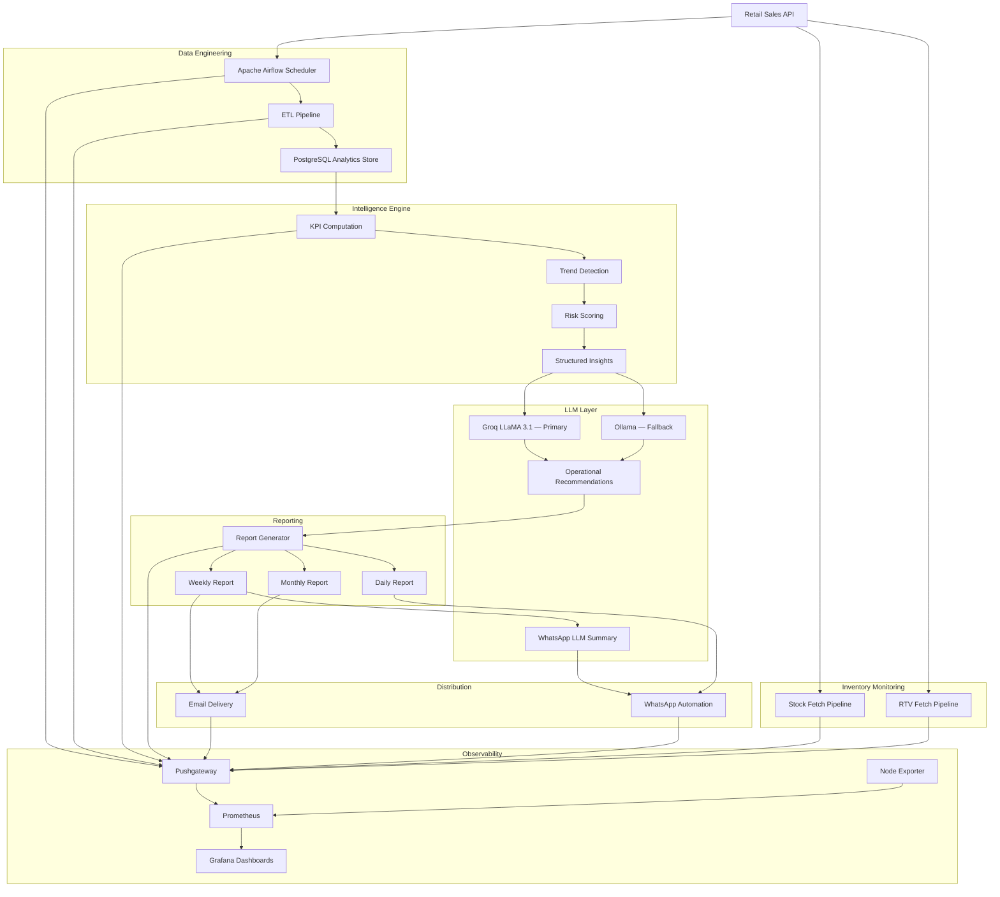
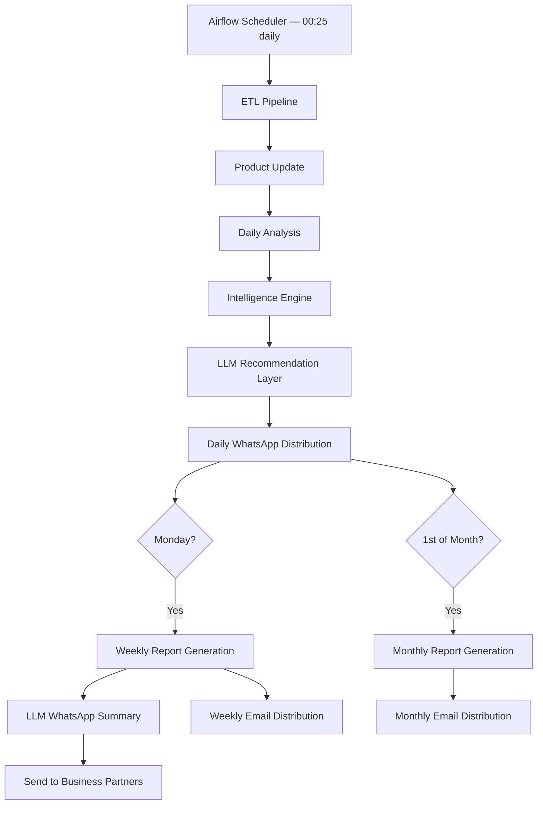

# Sales Intelligence Automation Engine

> A production-grade, fully automated analytics platform that ingests retail sales data, computes deterministic business intelligence signals, and delivers LLM-grounded operational recommendations via scheduled reports and real-time alerts — with zero manual intervention after deployment.

---

## Table of Contents

- [Overview](#overview)
- [System Architecture](#system-architecture)
- [Execution Flow](#execution-flow)
- [Core Capabilities](#core-capabilities)
- [Intelligence Engine](#intelligence-engine)
- [LLM Layer](#llm-layer)
- [Reporting](#reporting)
- [Distribution](#distribution)
- [Inventory & RTV Monitoring](#inventory--rtv-monitoring)
- [Observability](#observability)
- [Data Quality](#data-quality)
- [Reliability & Fault Containment](#reliability--fault-containment)
- [Installation & Setup](#installation--setup)
- [Design Principles](#design-principles)

---

## Overview

This system is not a dashboard. It is an automated sales intelligence engine built for multi-store retail operations. Every day, it ingests transactional data, computes KPIs and risk signals, generates store-level LLM recommendations, produces PDF reports, and distributes them — entirely without human intervention.

**What it does:**

- Ingests daily sales data via API into a PostgreSQL analytics store
- Computes revenue, margin, growth, and risk signals deterministically
- Generates LLM-grounded action recommendations constrained to pre-computed facts
- Produces Daily, Weekly, and Monthly PDF reports per store
- Distributes reports via Email and WhatsApp
- Detects low stock, negative stock (GRN anomalies), and RTV patterns
- Sends targeted WhatsApp stock alerts to business partners
- Exposes full pipeline observability via Prometheus and Grafana

---

## System Architecture


```mermaid
flowchart TD

A[Retail Sales API]

subgraph Data Engineering
B[Apache Airflow Scheduler]
C[ETL Pipeline]
D[PostgreSQL Analytics Store]
end

subgraph Intelligence Engine
E[KPI Computation]
F[Trend Detection]
G[Risk Scoring]
H[Structured Insights]
end

subgraph LLM Layer
I[Groq LLaMA 3.1 — Primary]
J[Ollama — Fallback]
K[Operational Recommendations]
W[WhatsApp LLM Summary]
end

subgraph Reporting
L[Report Generator]
M[Daily Report]
N[Weekly Report]
O[Monthly Report]
end

subgraph Distribution
P[Email Delivery]
Q[WhatsApp Automation]
end

subgraph Inventory Monitoring
X[Stock Fetch Pipeline]
Y[RTV Fetch Pipeline]
end

subgraph Observability
R[Prometheus]
S[Pushgateway]
T[Node Exporter]
U[Grafana Dashboards]
end

A --> B
B --> C
C --> D

D --> E
E --> F
F --> G
G --> H

H --> I
H --> J
I --> K
J --> K
K --> L

L --> M
L --> N
L --> O

N --> W
W --> Q
M --> Q
N --> P
O --> P

A --> X
A --> Y

B --> S
C --> S
E --> S
L --> S
P --> S
Q --> S
X --> S
Y --> S

S --> R
T --> R
R --> U
```

### Layer Summary

| Layer | Technology | Responsibility |
|---|---|---|
| Orchestration | Apache Airflow | DAG scheduling, retries, dependency management |
| Data | PostgreSQL | Analytics storage, snapshot persistence |
| Intelligence | Python — Pandas | KPI computation, trend detection, risk scoring |
| LLM | Groq + Ollama | Structured recommendation generation |
| Reporting | Python — pdfkit | PDF report generation per store |
| Distribution | SMTP + WhatsApp Business API | Email and WhatsApp delivery |
| Inventory | REST API | Stock and RTV data ingestion |
| Observability | Prometheus + Grafana | Metrics, dashboards, alerting |

---

## Execution Flow


```mermaid
flowchart TD
    A[Airflow Scheduler — 00:25 daily] --> B[ETL Pipeline]
    B --> C[Product Update]
    C --> D[Daily Analysis]
    D --> E[Intelligence Engine]
    E --> F[LLM Recommendation Layer]
    F --> G[Daily WhatsApp Distribution]

    G --> H{Monday?}
    H -->|Yes| I[Weekly Report Generation]
    I --> J[LLM WhatsApp Summary]
    J --> K[Send to Business Partners]
    I --> L[Weekly Email Distribution]

    G --> M{1st of Month?}
    M -->|Yes| N[Monthly Report Generation]
    N --> O[Monthly Email Distribution]
```

The master DAG (`sales_master_pipeline`) runs at `00:25` daily and branches deterministically based on the day of week and day of month. Weekly and monthly tasks execute sequentially after the daily chain completes, ensuring consistent data state at every stage.

---

## Core Capabilities

### ETL & Data Engineering
- API-driven daily ingestion from the retail mainframe
- Idempotent writes — safe to re-run without data duplication
- Time-window controlled processing with explicit scheduling boundaries
- Schema validation, null checks, range validation, and duplicate detection at ingestion
- Critical validation failures halt the pipeline; non-critical anomalies are logged

### Intelligence Engine
- Revenue, quantity, margin, and contribution KPIs per store, brand, category, and product
- WoW (Week-over-Week) and MoM (Month-over-Month) trend comparisons via snapshot tables
- Risk scoring: stockout risk, margin erosion, slow movers, concentration flags
- Anomaly detection: negative margins, single-unit dead stock, GRN discrepancies
- Predictive signals: rising stars, demand acceleration, margin decline trajectories

### Snapshot Memory
Historical snapshots are persisted to PostgreSQL after each run, enabling trend comparisons across periods without re-querying raw transaction data.

---

## Intelligence Engine

The intelligence engine operates as a pure computation layer — no LLM involvement. It produces structured, pre-computed signals that feed directly into the LLM prompt as facts.

**Signals computed per dimension (brand / category / product):**

- Top 10 by revenue with WoW/MoM change
- Bottom 5 by quantity with deviation from store average
- Low-margin and high-risk items (revenue-weighted risk score)
- Hidden margin gems (high margin, under-utilised shelf position)
- Mix-shift risk (high revenue share, below-average margin)
- Predictive signals: stockout risk, margin erosion, rising stars

This deterministic approach ensures LLM recommendations are grounded in actual numbers — the model cannot invent data it was not given.

---

## LLM Layer

The LLM layer is a **rendering layer, not a decision engine**. It receives pre-computed structured intelligence and converts it into store-manager-readable action bullets.

**Architecture:**
- **Primary**: Groq LLaMA 3.1 8B Instant — low latency, high throughput
- **Fallback**: Ollama (local) — activates automatically on Groq rate limits or failures
- **Fallback logic**: 2-attempt retry on Groq → rate limit detection → 30s wait → retry → switch to Ollama

**Prompt constraints enforced:**
- LLM may only use names and numbers present verbatim in the provided data
- One sentence per bullet — no chaining
- No generic phrases — every bullet must name a specific item and a specific action
- Deduplication enforced at Python level before prompt construction

**Recommendation dimensions per store per report:**
- Brand-level: 5 action bullets (stock priority, margin risk, hidden opportunity, slow movers, trend)
- Category-level: 5 action bullets (same structure)
- Product-level: 5 action bullets (same structure)

**Stock alerts (Python-generated, no LLM):**
- Negative stock (GRN anomaly) — deep red, urgent GRN reconciliation action
- Out-of-stock — red, reorder with vendor and value at risk
- Low stock — orange, top-up request with specific quantities
- High-value gap — blue, fast-track reorder for revenue-critical SKUs
- Systemic pattern — purple, escalation trigger when 3+ SKUs from same vendor

---

## Reporting

### Daily Report
- Store-wise, category-wise, brand-wise, and product-wise sales
- Rolling 7-day average comparison
- Growth percentage with conditional formatting

### Weekly Report
- WoW revenue, quantity, and margin comparison
- Risk scoring and anomaly detection per store
- LLM-generated action recommendations (brand, category, product)
- Current stock column injected from live stock CSV
- Low stock and negative stock alerts embedded in report
- RTV (Return to Vendor) summary if applicable

### Monthly Report
- MoM consolidated performance
- Trend-aware intelligence insights
- Strategic performance summary

All reports are generated as PDF files using `pdfkit` / `wkhtmltopdf` and are stored per store in `/store_reports/`.

---

## Distribution

### Email
- Weekly and monthly reports distributed via SMTP
- Per-store PDF attachments
- Failure tracking per recipient

### WhatsApp
- Daily sales summary sent via WhatsApp Business API
- Weekly LLM summary sent to business partners after weekly report
- Stock alerts sent to store business partners (low stock + negative stock)
- Partner mapping via `partner.csv` (`storeName`, `email`, `wa_number`)
- Phone numbers normalised automatically; 2-second send delay for API rate compliance

---

## Inventory & RTV Monitoring

### Stock Pipeline (`stock.py`)
- Fetches live store-level stock CSVs via authenticated API
- Saves per-store CSV to `store_stocks/`
- Feeds into weekly report for current stock column and stock alert generation
- Detects: negative stock (sold without GRN), low stock (≤ threshold units), out-of-stock

### RTV Pipeline (`rtv_report.py`)
- Fetches today's Return to Vendor data per store via API
- Parameters: `storeId`, `fromDate`, `toDate` (always current day)
- Saves per-store CSV to `store_rtv/`
- Tracks: return lines, unit quantities, total INR value, return reasons
- RTV summary embedded in weekly report if returns exist for the store

---

## Observability

The full pipeline is instrumented with Prometheus metrics pushed to a Pushgateway after each script run. Grafana visualises all metrics with a pre-built dashboard auto-provisioned on startup.

### Stack

| Component | Role | Port |
|---|---|---|
| Prometheus | Time-series metrics storage, 15-day retention on `/mnt` | 9090 |
| Pushgateway | Receives metrics from short-lived Python scripts | 9091 |
| Node Exporter | Host CPU, memory, disk metrics | 9100 |
| Grafana | Dashboards, alerting, Telegram notifications | 3000 |

### Metrics Coverage

**Pipeline health** — task success/failure counts, execution duration per script

**Database** — query latency per script, retry counts, connection failures

**LLM** — Groq vs Ollama call counts, latency, rate limit events, fallback frequency

**Reports** — per-store success/failure, generation time, stores processed per run

**Notifications** — WhatsApp send success/failure by message type, email delivery tracking

**Inventory** — negative stock SKU count per store, low stock SKU count per store

**RTV** — return lines per store, total return value (INR) per store

**Infrastructure** — CPU usage %, memory usage %, root disk %, `/mnt` disk %

### Alerting
Grafana alerts are configured to notify via **Telegram** on:
- Any script crash (`task_errors_total > 0`)
- Report generation failure
- LLM provider down (> 5 consecutive failures)
- Database errors
- Root disk above 85%

### Metrics Flow
```
Python scripts → Pushgateway → Prometheus → Grafana
Node Exporter ──────────────→ Prometheus → Grafana
```

### Monitoring Setup
```bash
chmod +x install_monitoring.sh
./install_monitoring.sh
```

Services after install:
- Grafana → `http://localhost:3000`
- Prometheus → `http://localhost:9090`
- Pushgateway → `http://localhost:9091`

---

## Data Quality

Validation is enforced at ETL ingestion before any data enters the analytics database.

| Check | Behaviour on failure |
|---|---|
| Schema validation (required fields, data types) | Record rejected, logged |
| Null checks on critical fields (revenue, quantity) | Record rejected, logged |
| Range validation (negative revenue, invalid margins) | Record rejected, logged |
| Duplicate detection | Duplicate removed, logged |
| API response integrity | Pipeline halted on critical failure |

Non-critical anomalies are logged and surfaced in the observability layer. Critical failures halt pipeline execution and trigger failure alerts.

---

## Reliability & Fault Containment

**Idempotency** — All DB writes use upsert logic. Re-running any script produces the same result without duplicating data.

**Retry strategy** — DB queries retry up to 5 times with exponential backoff. Groq API retries twice before falling back to Ollama. All retry events are tracked as metrics.

**Fault isolation** — ETL failures do not affect the reporting layer. Reporting failures do not corrupt the data layer. Each script is independently executable and independently monitored.

**Non-fatal monitoring** — Pushgateway push failures never raise exceptions. Monitoring failures are logged as warnings and never interrupt pipeline execution.

---

## Installation & Setup

### Clone
```bash
git clone https://github.com/SominZex/sales_analysis_algorithm.git
cd sales_analysis_algorithm
```

### Python Environment
```bash
python3 -m venv venv
source venv/bin/activate
pip install -r requirements.txt
```

### Environment Variables
Create a `.env` file in the project root:
```env
DB_USER=
DB_PASSWORD=
DB_HOST=
DB_PORT=5432
DB_NAME=

GROQ_API_KEY=
GROQ_MODEL=llama-3.1-8b-instant

OLLAMA_HOST=http://localhost:11434
OLLAMA_MODEL=llama3.2:3b

WA_TOKEN=
WA_PHONE_ID=

STOCK_DIR=store_stocks
RTV_DIR=store_rtv
LOW_STOCK_THRESHOLD=5

PUSHGATEWAY_URL=http://localhost:9091
```

### Airflow (Docker)
```bash
cd airflow
docker compose up airflow-init
docker compose up -d
```
Airflow UI: `http://localhost:8080`

```
airflow/
└── dags/
    └── sales_master_pipeline.py
```

### Monitoring (bare VM)
```bash
chmod +x install_monitoring.sh
./install_monitoring.sh
```

Installs Prometheus, Pushgateway, Node Exporter, and Grafana as systemd services. Prometheus TSDB data is stored on `/mnt` to preserve root partition space.

### DAG Workflow


---

## Design Principles

**Deterministic analytics over heuristic outputs** — KPIs and risk signals are computed with explicit logic. The LLM never calculates; it only renders pre-computed facts into natural language.

**LLM as rendering layer** — The model is constrained to names and numbers provided in the prompt. Prompt structure, deduplication, and bullet rules are enforced at the Python layer before the LLM is called.

**Observability-first** — Every script pushes metrics. Every failure is counted, typed, and visible in Grafana. Alerts fire on Telegram before the next morning's run.

**Fault isolation** — Each pipeline layer is independently executable. A failure in distribution does not affect data integrity. A failure in monitoring does not affect pipeline execution.

**Minimal operational dependency** — The system runs unattended. No human action is required between deployment and report delivery.

**Idempotent by design** — Every data write is safe to repeat. Duplicate runs produce identical state, not duplicate records.