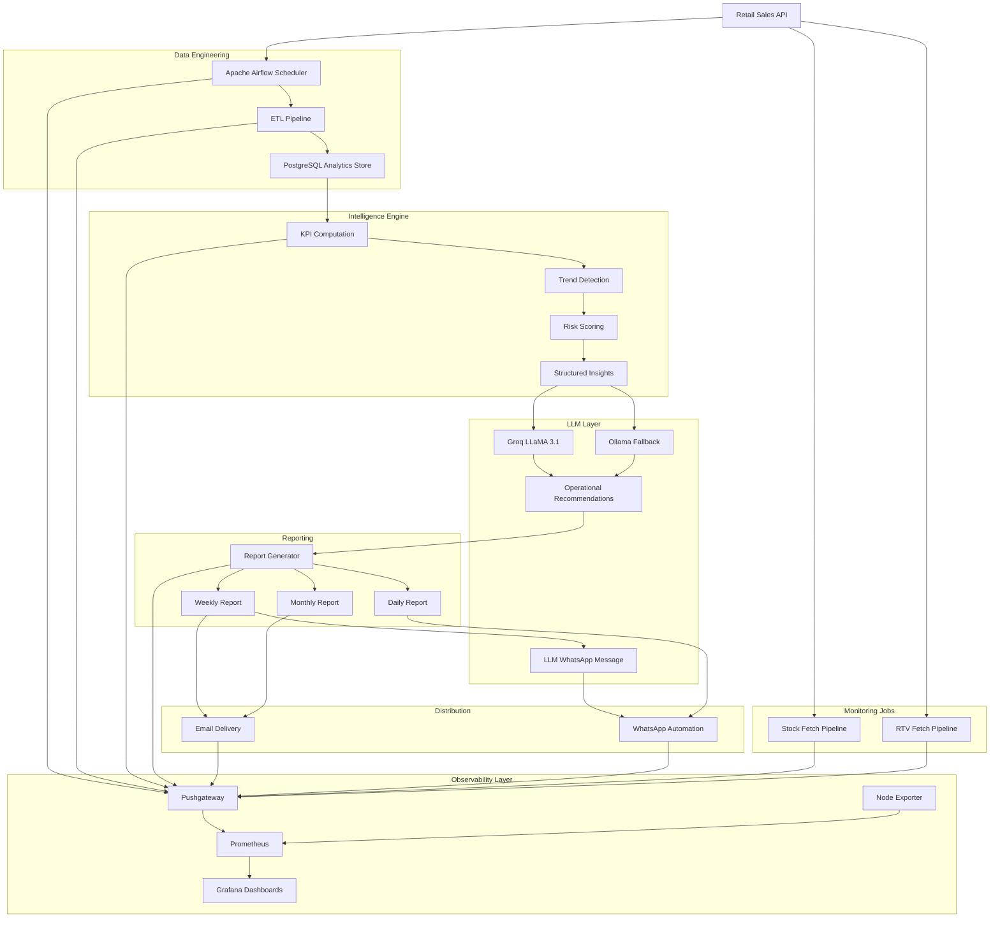
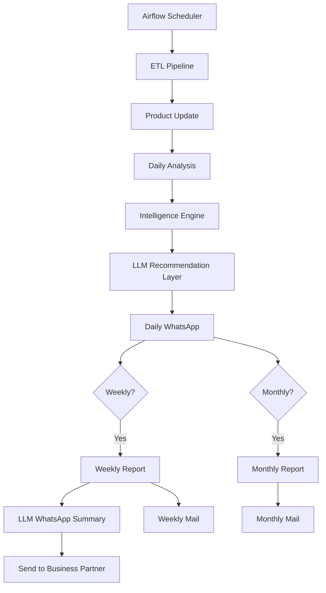

# LLM-Integrated Sales Intelligence Automation System

A production-grade automated analytics platform that ingests retail sales data,
computes deterministic business intelligence signals, and generates
LLM-grounded operational recommendations delivered via automated reports.


# 🏗️ System Architecture


```mermaid
flowchart TD

A[Retail Sales API]

subgraph Data Engineering
B[Apache Airflow Scheduler]
C[ETL Pipeline]
D[PostgreSQL Analytics Store]
end

subgraph Intelligence Engine
E[KPI Computation]
F[Trend Detection]
G[Risk Scoring]
H[Structured Insights]
end

subgraph LLM Layer
I[Groq LLaMA 3.1]
J[Ollama Fallback]
K[Operational Recommendations]
W[LLM WhatsApp Message]
end

subgraph Reporting
L[Report Generator]
M[Daily Report]
N[Weekly Report]
O[Monthly Report]
end

subgraph Distribution
P[Email Delivery]
Q[WhatsApp Automation]
end

subgraph Monitoring Jobs
X[Stock Fetch Pipeline]
Y[RTV Fetch Pipeline]
end

subgraph Observability Layer
R[Prometheus]
S[Pushgateway]
T[Node Exporter]
U[Grafana Dashboards]
end

A --> B
B --> C
C --> D

D --> E
E --> F
F --> G
G --> H

H --> I
H --> J
I --> K
J --> K

K --> L

L --> M
L --> N
L --> O

%% Notifications
N --> W
W --> Q

M --> Q
N --> P
O --> P

%% Monitoring jobs
A --> X
A --> Y

%% Observability flows
B --> S
C --> S
E --> S
L --> S
P --> S
Q --> S
X --> S
Y --> S

S --> R
T --> R
R --> U
```

## Overview

### This project is a fully automated sales reporting engine designed to:
- Generate Daily, Weekly, and Monthly business performance reports
- Process structured ETL workflows
- Persist historical performance snapshots
- Detect performance risks and trend shifts
- Generate LLM-grounded action recommendations
- Automatically distribute reports via Email and WhatsApp
- Operate without manual intervention after deployment
- Provide real-time observability into system health


### The system follows a hybrid orchestration architecture:
- Apache Airflow orchestrates everything
- A deterministic Intelligence Engine computes KPIs and risk signals
- A constrained LLM layer converts structured analytics into prioritized store-level actions

## Data Validation & Data Quality Check

The system enforces strict data validation during the ETL stage to ensure that all downstream analytics, intelligence signals, and LLM outputs are based on reliable and consistent data.

### Validation Strategy
Validation is performed during data ingestion before persistence into the analytics database.

### Checks Implemented
- Schema validation (required fields, correct data types)
- Null checks on critical fields (e.g. revenue, quantity)
- Range validation (e.g. negative revenue, invalid margins)
- Duplicate detection and removal
- API response integrity validation

### Failure Handling
- Invalid records are rejected or logged
- Critical validation failures halt pipeline execution
- Non-critical anomalies are logged for monitoring

### Impact
- Prevents corrupted data from entering the analytics layer
- Ensures deterministic KPI computation
- Reduces risk of incorrect LLM-generated recommendations
- Improves overall system reliability and trustworthiness

## Key Capabilities 
#### Data & ETL
- API-driven ingestion
- Idempotent pipelines
- Time-window controlled processing
- Safe re-runs

#### Intelligence Engine
- Revenue, margin, growth KPIs
- WoW / MoM comparisons
- Risk scoring (stockout, decline, anomalies)
- Snapshot-based historical memory

#### LLM Layer
- Structured prompting (no hallucination dependency)
- Groq primary + Ollama fallback
- Latency + fallback tracking

#### Reporting
- Daily operational reports
- Weekly performance reports
- Monthly strategic reports
- Store-level intelligence

### Notifications (Critical Addition)
#### Weekly LLM WhatsApp Summary
- Generated after weekly report
- LLM converts structured insights into:
- Actionable recommendations
- Business-readable summary
- Sent directly to business partners via WhatsApp

#### Stock Alerts
- Weekly stock data ingestion
##### Detects:
- Low stock SKUs
- Negative stock anomalies
- Sends WhatsApp alerts

### Monitoring Pipelines
#### Stock Pipeline
##### Fetches store-level stock CSVs via API
### Used for:
- Inventory monitoring
- Low stock alerts
- Negative stock detection

#### RTV Pipeline
##### Fetches daily RTV (Return to Vendor) data
### Tracks:
- Return volume
- Financial impact

## System Architecture
#### The system follows a layered orchestration strategy:

| Layer               | Technology              | Responsibility            |
| ------------------- | ----------------------- | ------------------------- |
| Orchestration       | Apache Airflow (Docker) | Scheduling, DAG execution |
| Data Layer          | PostgreSQL              | Analytics storage         |
| Intelligence Engine | Python (Pandas + logic) | KPI, trends, risk scoring |
| LLM Layer           | Groq + Ollama           | Recommendation generation |
| Reporting           | Python                  | PDF/Excel generation      |
| Distribution        | SMTP + WhatsApp APIs    | Delivery                  |
| Observability       | Prometheus + Grafana    | Monitoring & metrics      |


## Execution Flow


```mermaid
flowchart TD
    A[Airflow Scheduler] --> B[ETL Pipeline]
    B --> C[Product Update]
    C --> D[Daily Analysis]
    D --> E[Intelligence Engine]
    E --> F[LLM Recommendation Layer]
    F --> G[Daily WhatsApp]

    G --> H{Weekly?}
    H -->|Yes| I[Weekly Report]
    I --> J[LLM WhatsApp Summary]
    J --> K[Send to Business Partner]
    I --> L[Weekly Mail]

    G --> M{Monthly?}
    M -->|Yes| N[Monthly Report]
    N --> O[Monthly Mail]
```

## Reporting Logic
#### Daily Report
- Store-wise sales
- Category-wise sales
- Brand-wise sales
- Product-wise sales
- Comparison against rolling 7-day average
- Growth percentage computation
- Conditional formatting for performance signals
#### Weekly Report
- Aggregates prior week performance
- Designed for operational and management stakeholders
- WoW revenue & quantity comparison
- Margin shift detection
- Risk scoring and anomaly detection
- Operational action recommendations
- Low Stuck SKU notification
- Stock/sales level Anomaly Detection

## Monthly Report
- Consolidated monthly business performance
- Strategic performance summary
- Consolidated monthly business performance
- MoM comparison
- Strategic performance summary
- Trend-aware intelligence insights


## Installation & Setup
##### Clone the Repository:

```bash
git clone https://github.com/SominZex/sales_analysis_algorithm.git
```

```bash
cd sales_analysis_algorithm
```

## Create environment
```bash
python3 -m venv env_name
```

## Activate env
```bash
env_name/bin/activate
```

## Install Dependencies:
```bash
pip install -r requirements.txt
```
## Monitoring Setup

```bash
chmod +x install_monitoring.sh
./install_monitoring.sh
```

#### Services:

- Grafana → ```bash http://localhost:3000```
- Prometheus → ```bash http://localhost:9090```

### Infrastructure & Deployment
#### Containerized ETL (Docker + Airflow)
Airflow runs in Docker for:
- Environment reproducibility
- Dependency isolation
- Controlled orchestration
- Clean separation from OS-level automation

## Airflow Setup:
### Directory Structure
```bash
/sales_analysis_algorithm/
    /airflow/
        ├── dags/
        ├── docker-compose.yml
```

#### Start
```bash
cd airflow
docker compose up airflow-init
docker compose up -d
```
### Access UI
```bash
http://localhost:8080
```
### Workflow


## Observability & Reliability
#### Logging
#### Logs are generated for:
- ETL execution
- Report generation
- Email delivery
- WhatsApp automation

#### Logs support:
- Failure diagnosis
- Operational auditing
- Execution traceability

#### Determinism
- Idempotent data writes
- Controlled execution windows
- Duplicate prevention safeguards
- Explicit scheduling boundaries

#### Fault Containment
- ETL failures isolated from reporting layer
- Reporting failures do not corrupt data layer
- Layered orchestration prevents cascading impact

#### Observability & Monitoring

| Component     | Role                        |
| ------------- | --------------------------- |
| Prometheus    | Time-series metrics storage |
| Pushgateway   | Batch job metrics ingestion |
| Node Exporter | Infrastructure metrics      |
| Grafana       | Visualization dashboards    |

### Metrics Coverage
- Pipeline Health
- Task success/failure
- Execution time
- Data validation failures (ETL-level data quality issues)

### Database
- Query latency
- Retry tracking
- Failures

### LLM
- Latency
- Success rate
- Rate limits
- Fallback usage

### Reports
- Per-store success/failure
- Generation time

### Notifications
- WhatsApp success/failure
- Email delivery tracking

### Inventory
- Low stock SKUs
- Negative stock SKUs

### Financial
- RTV volume
- RTV value

### Metrics Flow
- Scripts → Pushgateway
- Prometheus scrapes metrics
- Grafana visualizes dashboards

## Reliability
#### Determinism
- Idempotent writes
- Controlled execution windows
- Snapshot-backed analytics

#### Retry Strategy
- DB retries tracked
- API failures isolated

## Design Principles
- Deterministic analytics > heuristic outputs
- LLM as rendering layer (not decision engine)
- Observability-first architecture
- Minimal operational dependency
- Clear separation of concerns

## CI/Automation
### GitHub Actions are configured for:
- Code validation
- Basic test execution
- Runtime automation is handled exclusively by Azure VM

## Design Principles
- Separation of concerns
- Deterministic data workflows
- Hybrid orchestration where appropriate
- Infrastructure-aware engineering decisions
- Production stability over tool overuse
- Minimal human operational dependency

## Final Note
### This project is not a traditional analytics dashboard.
### It is a production-grade automated sales intelligence engine designed for:

- Reliable analytics computation
- Deterministic insight generation
- Automated report delivery
- Minimal operational overhead

